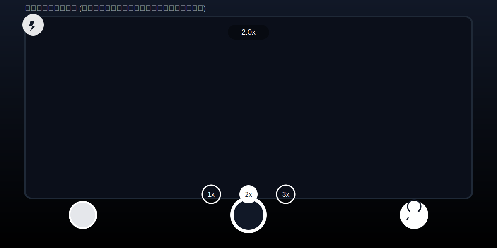
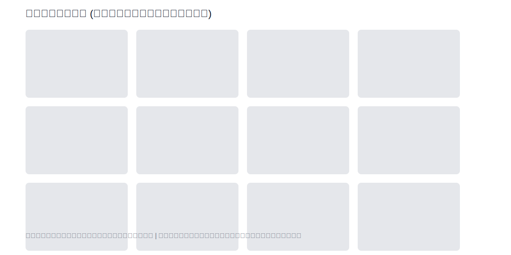
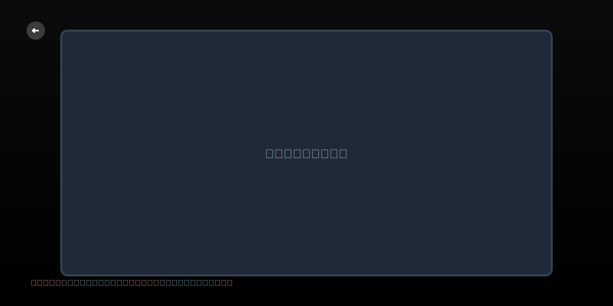

# Camera App (แอปถ่ายรูป + แกลเลอรี)

แอปนี้เป็นแอปถ่ายภาพใช้งานง่าย ที่ให้คุณถ่ายรูป ดูรูปในแกลเลอรี เปิดรูปแบบเต็มจอ และซูมได้ด้วยท่าทางเหมือน iOS ทั้งการหนีบนิ้ว (pinch) และการลากปรับซูมด้านล่าง พร้อมปุ่มลัดต่างๆ ที่ใช้งานสะดวกบนหน้ากล้อง

## แอปนี้ทำอะไรได้บ้าง
- ถ่ายภาพ: กดปุ่มชัตเตอร์ตรงกลางด้านล่างเพื่อถ่ายรูปได้ทันที
- สลับกล้องหน้า/หลัง: ปุ่มกลมขวาล่าง (ไอคอนสลับกล้อง)
- เปิด/ปิดแฟลช: ปุ่มกลมซ้ายบนของหน้ากล้อง (ไอคอนแฟลช)
- เข้าดูแกลเลอรี: ปุ่มกลมซ้ายล่าง (แสดงภาพล่าสุด) แตะเพื่อเปิดแกลเลอรี
- ซูมเหมือน iOS:
  - หนีบนิ้วบนหน้าพรีวิว (pinch-to-zoom)
  - ลากนิ้วบนปุ่มซูมด้านล่างกลาง หรือแตะค่าซูม 1x / 2x / 3x เพื่อกระโดดไปยังระยะนั้นทันที
- ดูภาพเต็มจอ: จากแกลเลอรีแตะที่รูปเพื่อเปิดเต็มจอ แล้วกดปุ่มย้อนกลับของเครื่องเพื่อกลับ

## วิธีใช้งานโดยย่อ
1) เปิดแอปและ “อนุญาต” สิทธิ์การใช้กล้องและเข้าถึงรูปภาพในเครื่องเมื่อมีการถาม
2) หน้า “ถ่ายภาพ” จะเปิดกล้องแบบเต็มจอทันที
3) แตะปุ่มกลมตรงกลางเพื่อถ่ายรูป (รูปจะถูกบันทึกลงคลังรูปภาพ และอัลบั้ม “Camera App” หากเครื่องรองรับ)
4) แตะปุ่มซ้ายล่างเพื่อเปิดแกลเลอรี และแตะรูปเพื่อดูแบบเต็มจอ
5) ใช้สองนิ้วหนีบ/ถ่างเพื่อซูม หรือใช้ชิป 1x/2x/3x ที่กึ่งล่างของหน้าจอเพื่อปรับซูมอย่างรวดเร็ว

## สิทธิ์ที่แอปต้องใช้ (เพื่อความชัดเจน)
- กล้อง: เพื่อถ่ายภาพจากอุปกรณ์ของคุณ
- คลังรูปภาพ (Photos/Media Library): เพื่อบันทึกภาพที่ถ่าย และแสดงรูปจากคลัง

## เคล็ดลับการใช้งาน
- ถ้ากดดูรูปในแกลเลอรีแล้วไม่แสดงทันที ให้รอสักครู่สำหรับการดึงไฟล์จากคลาวด์ (เช่น iCloud) หรือเช็คการอนุญาตสิทธิ์อีกครั้ง
- ปุ่มซูมด้านล่าง: ลากนิ้วซ้าย/ขวาเพื่อเลื่อนซูมต่อเนื่อง หรือแตะค่าซูม (1x/2x/3x) เพื่อเลือกทันที

## ภาพตัวอย่างการใช้งาน (Previews)
- หน้ากล้อง: `preview/main/fdfa57e1-08fc-46ae-b3e5-0bb82d504b04.jpg`

- หน้าแกลเลอรี: `preview/gallery/bddbecba-0498-4a27-bbe1-29c02c924947.jpg`

ไฟล์ตัวอย่างแบบแผนผัง (สำหรับอธิบายตำแหน่งปุ่ม):

หมายเหตุ: หากต้องการเพิ่ม/แทนที่รูปหน้าจอจริง ให้บันทึกภาพหน้าจอ (PNG/JPG) ลงในโฟลเดอร์ `preview/` แล้วแก้พาธใน README ให้ตรงกับไฟล์ของคุณ
