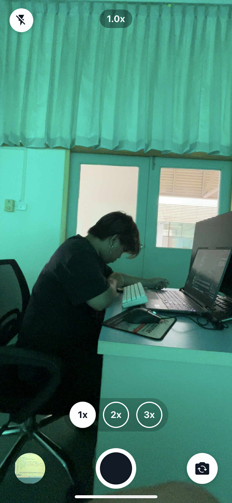
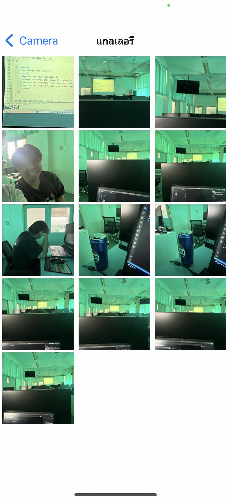

# Camera App (แอปถ่ายรูป + แกลเลอรี)

แอปถ่ายภาพใช้งานง่ายสำหรับผู้ใช้ทั่วไป เปิดกล้องเต็มจอ ถ่ายรูปได้ทันที สลับกล้องหน้า/หลัง เปิด‑ปิดแฟลช เข้าดูแกลเลอรีอย่างรวดเร็วจากปุ่มมุมซ้ายล่าง และซูมได้ทั้งแบบหนีบนิ้ว (pinch) และลากปรับซูมด้านล่างสไตล์ iOS พร้อมแสดงค่าระยะซูมแบบ 1x/2x/3x ชัดเจน

## แอปนี้ทำอะไรได้บ้าง
- ถ่ายภาพ: ปุ่มชัตเตอร์วงกลมตรงกลางด้านล่าง กดหนึ่งครั้งเพื่อถ่าย
- สลับกล้องหน้า/หลัง: ปุ่มวงกลมขวาล่าง (ไอคอนสลับกล้อง)
- เปิด/ปิดแฟลช: ปุ่มวงกลมซ้ายบน (ไอคอนแฟลช)
- เข้าแกลเลอรี: ปุ่มวงกลมซ้ายล่าง จะแสดงภาพล่าสุด กดเพื่อเข้าแกลเลอรี
- ซูมเหมือน iOS:
  - หนีบนิ้วบนพรีวิวกล้อง (pinch‑to‑zoom)
  - ลากนิ้วบนชิปซูมด้านล่างกลาง หรือแตะค่าซูม 1x / 2x / 3x เพื่อเลือกทันที
- ดูภาพเต็มจอ: แตะรูปในแกลเลอรีเพื่อเปิดเต็มหน้าจอ จากนั้นกดย้อนกลับเพื่อกลับ

## วิธีใช้งานโดยย่อ
1) เปิดแอปและ “อนุญาต” สิทธิ์การใช้กล้องและคลังรูปภาพเมื่อมีการถามครั้งแรก
2) หน้า “ถ่ายภาพ” จะเปิดกล้องเต็มจอทันที สามารถกดชัตเตอร์เพื่อถ่ายรูปได้เลย
3) หลังถ่ายรูป รูปจะถูกบันทึกลงคลังรูปภาพ (และอัลบั้ม “Camera App” ถ้ารองรับ)
4) แตะปุ่มมุมซ้ายล่างเพื่อเข้าแกลเลอรี แล้วแตะรูปเพื่อดูแบบเต็มหน้าจอ
5) ใช้สองนิ้วหนีบ/ถ่างเพื่อซูม หรือปรับด้วยชิป 1x/2x/3x ที่กึ่งล่างของหน้าจอ

## สิทธิ์ที่แอปต้องใช้
- กล้อง: เพื่อถ่ายภาพจากอุปกรณ์ของคุณ
- คลังรูปภาพ (Photos/Media Library): เพื่อบันทึกและแสดงรูปจากคลังของอุปกรณ์

## เคล็ดลับ
- หากบางรูปอยู่บนคลาวด์ (เช่น iCloud) อาจต้องรอสักครู่ระหว่างดึงไฟล์ลงมาแสดง
- ปุ่มซูมแบบชิป: ลากนิ้วเพื่อปรับซูมต่อเนื่อง หรือแตะค่า 1x/2x/3x เพื่อกระโดดอย่างรวดเร็ว

## ภาพตัวอย่างการใช้งาน (Previews)
- หน้ากล้อง: `preview/main/fdfa57e1-08fc-46ae-b3e5-0bb82d504b04.jpg`

- หน้าแกลเลอรี: `preview/gallery/bddbecba-0498-4a27-bbe1-29c02c924947.jpg`

หากต้องการเพิ่มรูปหน้าจออื่นๆ ให้บันทึกภาพ (PNG/JPG) ลงในโฟลเดอร์ `preview/` แล้วปรับพาธใน README ให้ชี้ไปยังไฟล์ใหม่ได้เลย

